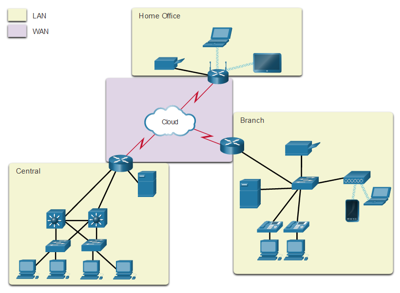

# actividad-6

> En construcción

## Revisión teórica

### Tipos de redes

Las infraestructuras de red pueden variar en gran medida en términos de:
* El tamaño del área que abarcan.
* La cantidad de usuarios conectados.
* La cantidad y los tipos de servicios disponibles.
* El área de responsabilidad

A continuación se muestra una clasificación simple

* Red de area personal: Es una red que conecta diferentes dispositivos dentro de un area pequeña. Este tipo de red conecta tipicamente wearables. 
* Red de área local (LAN): Es una infraestructura de la red que abarca un área geográfica pequeña. Las redes residenciales, SOHO y corporativas son casos tipicos de este tipo. 
* Red de área amplia (WAN): Es una infraestructura de la red que abarca un área geográfica extensa. Permiten la conexión de varias redes LAN entre sí.





|Tipo|Tecnologias|
|---|---|
|PAN|Bluetooth radio, Bluetooth Low Energy, ZigBee, Z-Wave, Thread, 6LoWPAN, Wired|
|LAN| Wi-Fi, Ethernet|
|MAN| SigFox, LoRaWAN, NB-IOT (Narrow Band IOT) |


Las bandas ISM (Industrial, Scientific and Medical) son bandas de radio frecuencia reservadas internacionalmente para el uso con propósitos industriales, científicos y médicos.


|Caracteristica|Bluetooth Classic | Bluetooth Low Energy | Bluetooth Mesh | Zigbee | Wi-Fi | LTE-M |NB-IoT|Sigfox|LoRaWAN|
|---|---|---|---|---|---|---|---|---|---|
|Rango| Hasta 100 m| Hasta 200 m o 400 m con LR|Hasta 200 m|Hasta 200 m|Hasta 200 m|Hasta 10 km|Hasta 10 km|Hasta 50 km|Hasta 20 km|
|Frecuencia|2.4 GHz|2.4 GHz|2.4 GHz|2.4 GHz|2.4 GHz, 5 GHz|---|---|915 MHz (America)|902 MHz |
|Throughput|Hasta 3 Mbps|Hasta 2 Mbps|Hasta 1 Mbps|Hasta 250 Kbps|Hasta 100 Mbps|Hasta 1 Mbps|Hasta 200 Kbps|Hasta 100 bps|10 Kbps - 50 Kbps|
|Ongoing cost|Una vez|Una vez|Una vez|Una vez|Una vez|Recurrente|Recurrente|Recurrente|Una vez|
|Consumo de potencia|Bajo|Bajo|Bajo|Bajo|Medio|Medio|Bajo|Bajo|Bajo|
|Costo del módulo|Menores de $5|Menores de $5|Menores de $5|$8 - $15|Menores de $10|$8 - $20|Menores de $5|$8 - $15|
|Topologia|P2P, Star|P2P, Star, Broadcast|Mesh|Mesh|Star, Mesh|Star|Star|Star|Star|

Para mas información puede encontrar una comparación mas detallada en el siguiente [enlace de wikipedia](https://en.wikipedia.org/wiki/Comparison_of_wireless_data_standards).


## APIs

Una interfaz de programación de aplicaciones (API) permite una conversación de software con otra.  Utiliza interacciones basadas en la web o protocolos de comunicación comunes y sus propios estándares patentados determinando qué tipo de datos, servicios y funcionalidad expone la aplicación a terceros.


Las API están diseñadas para ser consumidas mediante programación por otras aplicaciones y también pueden ser usadas por usuarios que desean interactuar con la aplicación manualmente. 

Los tres tipos más populares de estilos arquitectónicos API son:
* RPC
* SOAP
* REST

## API REST

Transferencia de Estado Representacional (REST) es un estilo arquitectónico escrito por Roy Thomas Fielding.

Una API de servicio web REST (API REST) es una interfaz de programación que se comunica a través de HTTP, por lo que utiliza los mismos conceptos que el protocolo HTTP:
* Solicitudes/respuestas HTTP
* Verbos HTTP
* Código de estado HTTP
* Encabezados/cuerpo HTTP


A continuación vamos a analizar tanto las solicitudes como las respuestas.

### Solicitudes de API REST

Las solicitudes de API REST son solicitudes HTTP en las que una aplicación (cliente) pide al servidor que realice una función.  Las solicitudes de API REST se componen de cuatro componentes principales:
* **Identificador uniforme de recursos (URI)**: También conocido como **localizador uniforme de recursos (URL)**, identifica qué recurso desea manipular el cliente. 
  
  

  Tal y como se resalta en la figura anterior, las URI tienen los siguientes componentes:
  * **Esquema**: especifica qué protocolo HTTP se debe usar, http o https.
  * **Autoridad**: consta de dos partes, a saber, host y puerto
  * **Ruta de acceso**: representa la ubicación del recurso, los datos u objeto, que se va a manipular en el servidor. 
  * **Consulta**: proporciona detalles adicionales sobre el ámbito, el filtrado o para aclarar una solicitud. 
  
* **Método HTTP:**: Empleado para comunicarse con los servicios web para los que se solicita la acción para el recurso dado. La asignación sugerida del método HTTP a la acción es la siguiente:
  
  |Método HTTP:|Acción|Descripción|
  |---|---|---|
  |POST|Crear (Create)|Crear un nuevo objeto o recurso.|
  |GET|lectura (Read)|Recuperar detalles de recursos del sistema.|
  |PUT|Actualizar|Reemplace o actualice un recurso existente.|  
  |PARCHE|Actualización parcial|Actualice algunos detalles de un recurso existente.|
  |DELETE|Eliminar (Delete)|Remover un recurso del sistema.|

* **Encabezado**: tienen el formato de pares **```nombre-valor```** separados por dos puntos (**:**); esto es, ```[nombre]: [valor]```. Podemos distinguir dos tipos de encabezados:
  *  **Encabezados de solicitud**: incluye información adicional que no esté relacionada con el contenido del mensaje.
  

    |Clave | Valor de ejemplo |Descripción |
    |---|---|---|
    |Autorización|DMFNCMFUDDP2YWDYYW básico|Proporciona credenciales para autorizar la solicitud|


  *  **Encabezados de entidad**: información adicional que describe el contenido del cuerpo del mensaje.
    

    |Clave | Valor de ejemplo |Descripción |
    |---|---|---|
    |Tipo de contenido|aplicación/ JSON|PEspecificar el formato de los datos en el cuerpo|
 
* **Cuerpo**: El cuerpo de la solicitud de API REST contiene los datos correspondientes al recurso que el cliente desee manipular. Las solicitudes de API REST que utilizan el método HTTP POST, PUT y PATCH suelen incluir un cuerpo lo que hace que cuerpo sea opcional dependiendo del método HTTP. 

### Respuestas API REST

Las respuestas de la API REST son respuestas HTTP que comunica los resultados de la solicitud HTTP de un cliente. La Respuesta REST API se componen de tres componentes principales:
* **Estado HTTP**: El código de estado HTTP ayuda al cliente a determinar el motivo del error y a veces puede proporcionar sugerencias para solucionar el problema. Los códigos de estado HTTP constan de tres dígitos, donde el primer dígito es la categoría de respuesta y los otros dos dígitos son asignados en orden numérico. Hay cinco categorías diferentes de códigos de estado HTTP:
   * **1xx - Informativo**: con fines informativos, las respuestas no contienen un cuerpo
   * **2xx - Éxito**: el servidor recibió y ha aceptado la solicitud
   * **3xx - Redirección**: el cliente tiene que tomar una acción adicional para completar la solicitud
   * **4xx - Error de cliente**: la solicitud contiene un error como sintáxis incorrecta o entrada no válida
   * **5xx - Error del servidor**: no se pueden cumplir las solicitudes válidas.
 
    Los codigos de estado mas comunes se muestran a continuación:

    |Código de Estado HTTP|Mensaje de estado|Descripción|
    |---|---|---|
    |200|Aceptar|La solicitud se realizó correctamente y normalmente contiene una carga útil (cuerpo)|
    |201|Creada|Se cumplió la solicitud y se creó el recurso que fue solicitado|
    |202|Aceptada|La solicitud ha sido aceptada para su procesamiento y está en proceso|
    |400|Solicitud no valida|La solicitud no se procesará debido a un error con la solicitud|
    |401|No autorizado|La solicitud no tiene credenciales de autenticación válidas para realizar la solicitud|
    |403|Prohibida|La solicitud ha sido entendida pero ha sido rechazada por el servidor|
    |404|No se encontró|No se puede cumplir la solicitud porque la ruta de acceso del recurso de la solicitud no se encontró en el servidor|
    |500|Error del servidor interno|No se puede cumplir la solicitud debido a un error del servidor|
    |503|El servicio no está disponible|No se puede cumplir la solicitud porque actualmente el servidor no puede manejar la solicitud|

* **Encabezado**: El encabezado de la respuesta proporciona información adicional entre el servidor y el cliente en el formato de par **```nombre-valor```** que está separado por dos puntos (**:**), ```[nombre]:[valor]```. Hay dos tipos de encabezados: 
   * **Encabezados de respuesta**: contiene información adicional que no está relacionada con el contenido del mensaje. Los encabezados de respuesta típicos para una solicitud de API REST incluyen:
    
     |Clave|Valor de ejemplo|Descripción|
     |---|---|---|
     |Set-Cookie|JSESSIONID=30A9DN810FQ428P; Ruta=/|Se utiliza para enviar Cookies desde el servidor|
     |Control de caché|Control de caché: max-edad=3600, público|Especificar directivas que DEBEN ser obedecidas por todos los mecanismos de almacenamiento en el caché|

   * **Encabezados de entidad**: son información adicional que describe el contenido del cuerpo del mensaje. Un encabezado de entidad común especifica el tipo de datos que son devueltos:

     |Clave|Valor de ejemplo|Descripción|
     |---|---|---|
     |Tipo de contenido|Aplicación/JSON|SEspecificar el formato de los datos en el cuerpo|
    
* **Cuerpo**: Contiene los datos asociados a la respuesta.

## Librerias Wifi

Para hacer posible una conexión empleando Wifi, es necesario contar con un **Access Point (AP)**. Un **AP** es un dispositivo que permite la conexión de dispositivos Wi-Fi a una red cableada tal y como se muestra en la siguiente figura:


Para permitir la conexión de una placa Arduino a un red wifi se emplea el **Arduino WiFi**. Esto es posible gracias a la libreria **WiFi** ([link](https://www.arduino.cc/en/Reference/WiFi)) (la cual viene incluida en el Arduino IDE).
A continuación se muestran las clases de mayor uso de esta libreria:

### Clase WiFi 
La clase WiFi inicializa la biblioteca de ethernet y la configuración de red. La siguiente tabla muestra algunos de los principales métodos:

|Método|Descripción|Sintaxis|
|---|---|---|
|```WiFi.begin()```|Inicializa la configuración de red de la biblioteca WiFi y proporciona el estado actual|```WiFi.begin();``` <br> ```WiFi.begin(ssid);``` <br> ```WiFi.begin(ssid, pass);``` 
|```WiFi.disconnect()```|Desconecta la placa WiFi de la red actual.|```WiFi.disconnect();```|
|```WiFi.status()```|Devuelve el estado de la conexión (```WL_CONNECTED```, ```WL_CONNECTION_LOST```, ```WL_DISCONNECTED``` y ```WL_CONNECT_FAILED``` entre otros).|```WiFi.status();```|


### Clase IPAddress 

La clase ```IPAddress``` proporciona información sobre la configuración de la red. La siguiente tabla muestra los métodos de la clase ```Wifi``` que son empleados con esta clase:

|Método|Descripción|Sintaxis|
|---|---|---|
|```WiFi.localIP()```|Obtiene la dirección IP de la placa WiFi.|```WiFi.localIP();```|
|```WiFi.subnetMask()```|Obtiene la mascara de subred de la placa WiFi.|```WiFi.subnetMask();```|
|```WiFi.gatewayIP()```|Obtiene la dirección IP de la puerta de enlace de la placa WiFi.|```WiFi.gatewayIP();```|

### Clase Server

La clase Server crea servidores que pueden enviar y recibir datos de clientes conectados (programas que se ejecutan en otras computadoras o dispositivos). Esta clase, es la clase base de Wifi Server. Para su instanciación se emplea el siguiente constructor:

|Clase|Descripción|Sintaxis del constructor|
|---|---|---|
|```WiFiServer```|Crea un servidor que escucha las conexiones entrantes en el puerto especificado.|```Server(port);```|

A continuación se resumen algunos de los principales métodos asociados a esta clase.

|Método|Descripción|Sintaxis|
|---|---|---|
|```begin()```|Le dice al servidor que comience a escuchar las conexiones entrantes.|```server.begin();```|

### Clase Client

La clase client crea clientes que pueden conectarse a servidores y enviar y recibir datos.

|Método|Descripción|Sintaxis|
|---|---|---|
|```WiFiClient()```|Crea un cliente que puede conectarse a una dirección IP y un puerto de Internet especificados como se define en ```client.connect()```.|```WiFiClient();```|
|```connected()```|Determina si el cliente está conectado o no |```client.connected();```|

Debido al uso masivo del ESP8266, se creo una libreria WiFi (la cual trata de conservar la filosofia de la libreria original para Arduino) para esta plataforma. Para consultar mas sobre esta libreria puede dirigirse a la sección del [ESP8266WiFi library](https://arduino-esp8266.readthedocs.io/en/latest/esp8266wifi/readme.html) API de [ESP8266 Arduino Core](https://arduino-esp8266.readthedocs.io/en/latest/index.html).

Para mayor información puede consultar:
1. [Arduino WiFi library](https://www.arduino.cc/en/Reference/WiFi)
2. [ESP8266 Arduino Core’s](https://arduino-esp8266.readthedocs.io/en/latest/index.html)
3. [ESP8266 Arduino Core’s en español](https://esp8266-arduino-spanish.readthedocs.io/es/latest/#)
   

## Enlaces

1. https://wokwi.com/
2. https://markmegarry.github.io/AVR8js-Falstad/
3. https://wokwi.com/
4. https://tawjaw.github.io/Arduino-Robot-Virtual-Lab/
5. https://tawjaw.github.io/Arduino-Robot-Virtual-Lab/index.html
6. https://forum.arduino.cc/t/virtual-online-arduino-and-esp32-simulator-wokwi-arduino-simulator-features/698481/5
7. http://iotfactory.eu/iot-knowledge-center/overview-of-iot-networks/
8. https://www.c-sharpcorner.com/UploadFile/f88748/internet-of-things-iot-an-introduction/
9. https://www.c-sharpcorner.com/UploadFile/f88748/internet-of-things-part-2/
10. https://www.c-sharpcorner.com/UploadFile/f88748/internet-of-things-iot-part-3/
11. https://www.c-sharpcorner.com/UploadFile/f88748/internet-of-thingsiot-part-4-network-protocols-and-arc/
12. https://www.ccontrols.net/cz-sk/applications/internet-of-things-iot/wireless-networks/
13. https://www.sam-solutions.com/blog/internet-of-things-iot-protocols-and-connectivity-options-an-overview/
14. https://www.lanner-america.com/es/iot/
15. https://en.wikipedia.org/wiki/Comparison_of_wireless_data_standards
16. https://www.digikey.com/en/articles/comparing-low-power-wireless-technologies
17. https://www.digikey.com/en/articles/comparing-low-power-wireless-technologies-part-2
18. https://bismark.net.co/como-avanzan-redes-lpwan/
19. http://www.ane.gov.co/Documentos%20compartidos/ArchivosDescargables/consultapublica/contenidos/ComentariosAnexoNormatividadUsoLibre/Respuesta_Comentarios_Anexo_Normatividad_Uso_Libre.pdf
20. https://www.aprendiendoarduino.com/tag/sigfox/
21. https://repositorio.uchile.cl/bitstream/handle/2250/171099/Evaluacion-del-protocolo-HTTP2-para-Internet-de-las-cosas.pdf?sequence=1&isAllowed=y
22. https://editores-srl.com.ar/sites/default/files/aa2_semle_protocolos_ilot.pdf
23. https://forum.huawei.com/enterprise/es/protocolo-http-en-iot-miuconhuawei/thread/624779-100275
24. https://cloud.google.com/blog/products/iot-devices/http-vs-mqtt-a-tale-of-two-iot-protocols
25. https://microsoft.github.io/IoT-For-Beginners/#/2-farm/lessons/2-detect-soil-moisture/README
26. https://docs.microsoft.com/en-us/azure/iot-hub/iot-hub-devguide-protocols
27. https://docs.oracle.com/en/cloud/paas/iot-cloud/iotrq/toc.htm
28. https://www.nabto.com/rest-api-iot-guide/
29. https://docs.microsoft.com/en-us/rest/api/iothub/


