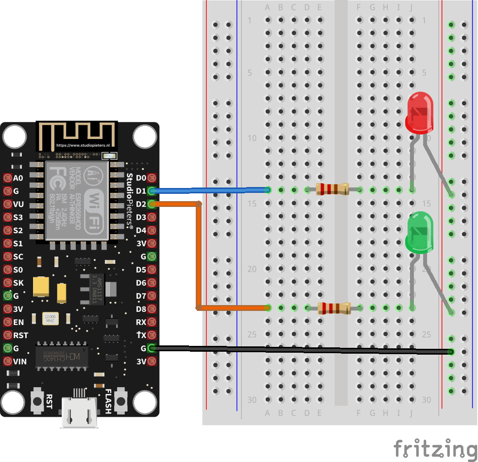
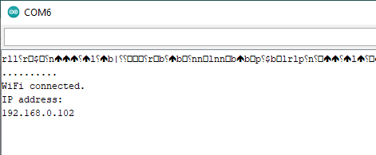
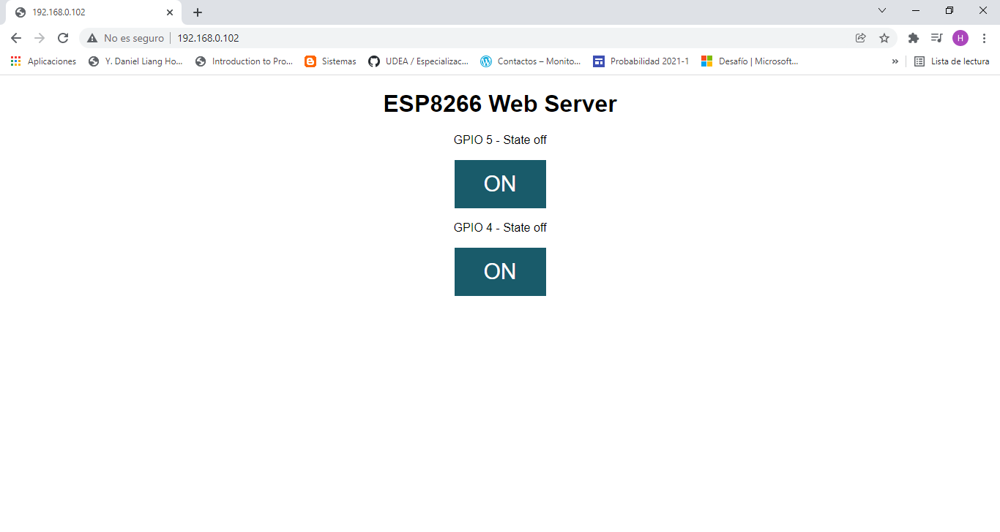

# Ejemplo 4

## Descripción

El codigo que se muestra a continuación hace que un NodeMCU funcione como servidor web de tal manera que, a traves de la pagina desplegada en el browser es posible prender y apagar dos leds que se encuentran conectados al NodeMCU. Este ejemplo se tomo en su totalidad de la pagina [Build an ESP8266 Web Server – Code and Schematics (NodeMCU)](https://randomnerdtutorials.com/esp8266-web-server/). La explicación y el funcionamiento de este se explica en esta pagina.


## Componentes necesarios

1. NodeMCU
2. Resistencias de 330 Ohm (x2)
3. Leds (x2)
4. Protoboard.
5. Cables de protoboard

## Conceptos previos
En este ejemplos se abordan conceptos:
1. Conexión de un ESP8266 a una red inalambrica.
2. ESP8266 como servidor Web.
3. Manejo de puertos de entrada y salida.

## Monjate

Aunque en la pagina se encuentra el montaje, se adjunto el archivo fritzing relacionado en esta pagina. A continuación se muestra la imagen del montaje realizado



## Código

**Codigo:** [server-leds.ino](server-leds/server-leds.ino)

```arduino
// Load Wi-Fi library
#include <ESP8266WiFi.h>

// Replace with your network credentials
const char* ssid     = "SSID";
const char* password = "clave-ssid";

// Set web server port number to 80
WiFiServer server(80);

// Variable to store the HTTP request
String header;

// Auxiliar variables to store the current output state
String output5State = "off";
String output4State = "off";

// Assign output variables to GPIO pins
const int output5 = 5; // GPIO5 = D1
const int output4 = 4; // GPIO4 = D2

// Current time
unsigned long currentTime = millis();
// Previous time
unsigned long previousTime = 0; 
// Define timeout time in milliseconds (example: 2000ms = 2s)
const long timeoutTime = 2000;

void setup() {
  Serial.begin(115200);
  // Initialize the output variables as outputs
  pinMode(output5, OUTPUT);
  pinMode(output4, OUTPUT);
  // Set outputs to LOW
  digitalWrite(output5, LOW);
  digitalWrite(output4, LOW);

  // Connect to Wi-Fi network with SSID and password
  Serial.print("Connecting to ");
  Serial.println(ssid);
  WiFi.mode(WIFI_STA);
  WiFi.begin(ssid, password);
  while (WiFi.status() != WL_CONNECTED) {
    delay(500);
    Serial.print(".");
  }
  // Print local IP address and start web server
  Serial.println("");
  Serial.println("WiFi connected.");
  Serial.println("IP address: ");
  Serial.println(WiFi.localIP());
  server.begin();
}

void loop(){
  WiFiClient client = server.available();   // Listen for incoming clients

  if (client) {                             // If a new client connects,
    Serial.println("New Client.");          // print a message out in the serial port
    String currentLine = "";                // make a String to hold incoming data from the client
    currentTime = millis();
    previousTime = currentTime;
    while (client.connected() && currentTime - previousTime <= timeoutTime) { // loop while the client's connected
      currentTime = millis();         
      if (client.available()) {             // if there's bytes to read from the client,
        char c = client.read();             // read a byte, then
        Serial.write(c);                    // print it out the serial monitor
        header += c;
        if (c == '\n') {                    // if the byte is a newline character
          // if the current line is blank, you got two newline characters in a row.
          // that's the end of the client HTTP request, so send a response:
          if (currentLine.length() == 0) {
            // HTTP headers always start with a response code (e.g. HTTP/1.1 200 OK)
            // and a content-type so the client knows what's coming, then a blank line:
            client.println("HTTP/1.1 200 OK");
            client.println("Content-type:text/html");
            client.println("Connection: close");
            client.println();
            
            // turns the GPIOs on and off
            if (header.indexOf("GET /5/on") >= 0) {
              Serial.println("GPIO 5 on");
              output5State = "on";
              digitalWrite(output5, HIGH);
            } else if (header.indexOf("GET /5/off") >= 0) {
              Serial.println("GPIO 5 off");
              output5State = "off";
              digitalWrite(output5, LOW);
            } else if (header.indexOf("GET /4/on") >= 0) {
              Serial.println("GPIO 4 on");
              output4State = "on";
              digitalWrite(output4, HIGH);
            } else if (header.indexOf("GET /4/off") >= 0) {
              Serial.println("GPIO 4 off");
              output4State = "off";
              digitalWrite(output4, LOW);
            }
            
            // Display the HTML web page
            client.println("<!DOCTYPE html><html>");
            client.println("<head><meta name=\"viewport\" content=\"width=device-width, initial-scale=1\">");
            client.println("<link rel=\"icon\" href=\"data:,\">");
            // CSS to style the on/off buttons 
            // Feel free to change the background-color and font-size attributes to fit your preferences
            client.println("<style>html { font-family: Helvetica; display: inline-block; margin: 0px auto; text-align: center;}");
            client.println(".button { background-color: #195B6A; border: none; color: white; padding: 16px 40px;");
            client.println("text-decoration: none; font-size: 30px; margin: 2px; cursor: pointer;}");
            client.println(".button2 {background-color: #77878A;}</style></head>");
            
            // Web Page Heading
            client.println("<body><h1>ESP8266 Web Server</h1>");
            
            // Display current state, and ON/OFF buttons for GPIO 5  
            client.println("<p>GPIO 5 - State " + output5State + "</p>");
            // If the output5State is off, it displays the ON button       
            if (output5State=="off") {
              client.println("<p><a href=\"/5/on\"><button class=\"button\">ON</button></a></p>");
            } else {
              client.println("<p><a href=\"/5/off\"><button class=\"button button2\">OFF</button></a></p>");
            } 
               
            // Display current state, and ON/OFF buttons for GPIO 4  
            client.println("<p>GPIO 4 - State " + output4State + "</p>");
            // If the output4State is off, it displays the ON button       
            if (output4State=="off") {
              client.println("<p><a href=\"/4/on\"><button class=\"button\">ON</button></a></p>");
            } else {
              client.println("<p><a href=\"/4/off\"><button class=\"button button2\">OFF</button></a></p>");
            }
            client.println("</body></html>");
            
            // The HTTP response ends with another blank line
            client.println();
            // Break out of the while loop
            break;
          } else { // if you got a newline, then clear currentLine
            currentLine = "";
          }
        } else if (c != '\r') {  // if you got anything else but a carriage return character,
          currentLine += c;      // add it to the end of the currentLine
        }
      }
    }
    // Clear the header variable
    header = "";
    // Close the connection
    client.stop();
    Serial.println("Client disconnected.");
    Serial.println("");
  }
}
```

## Resultado

Si la conexión es exitosa se debería ver la siguiente salida en el monitor serial del Arduino IDE.



Como se puede ver, la IP de la placa es ```192.168.0.102``` por lo que se procede a ejecutar el comando ```ping 192.168.0.102``` para verificar que haya conectividad.


Finalmente, solo queda acceder al servidor a traves del browser colocando la IP de la placa.



Haga las respectivas pruebas controlando los leds.

## Actividad

Teniendo en cuenta los pasos hechos en el ejemplo anterior, realizar los siguientes montajes.

Para realizar cada solución usted deberá:
1. Hacer el diagrama en Fritzing.
2. Poner a funcionar el código.
3. Modificar el README.md asociado al montaje en cuestion, de tal manera que describa de manera resumida el funcionamiento general.
4. Agregar los codigos solución en el directorio del montaje.

### Montaje 1

* **ESP8266 NodeMCU Web Server with Slider: Control LED Brightness (PWM)** - [link](https://randomnerdtutorials.com/esp8266-nodemcu-web-server-slider-pwm/)
* **Solución**: [Archivos montaje1](montaje1)

### Montaje 2

* **ESP8266 NodeMCU Web Server (WebSocket) with Multiple Sliders: Control LEDs Brightness (PWM)** - [link](https://randomnerdtutorials.com/esp8266-nodemcu-web-server-websocket-sliders/)
* **Solución**: [Archivos montaje2](montaje2)


